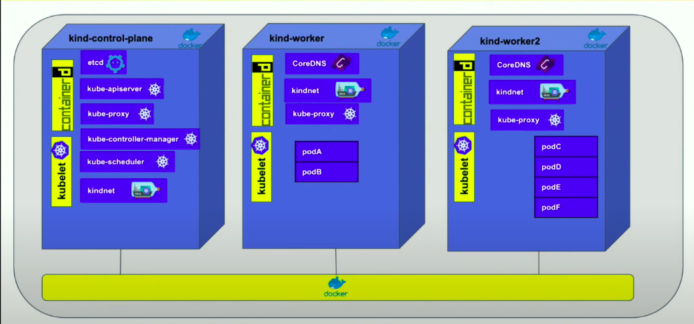

# Configure Kind 

One control plane node and three "workers".
While these will not add more real compute capacity and have limited isolation, this can be useful to simulate a real environtment(ex. testing rolling updates).   
The API-server and other control plane components will be on the control-plane node.

```yaml
kind: Cluster
apiVersion: kind.x-k8s.io/v1alpha4
nodes:
- role: control-plane
- role: worker
- role: worker
```

Create a cluster with a specific configuration and name.

```bash
kind create cluster --config setup-kind/kind_config.yaml --name kind-istio
```

Check if the docker has created the nodes:

```bash
$ docker ps
CONTAINER ID        IMAGE                  COMMAND                  CREATED             STATUS              PORTS                       NAMES
3d30ed08d52e        kindest/node:v1.19.1   "/usr/local/bin/entr…"   2 hours ago         Up 2 hours                                      kind-istio-worker
3b7e5830f450        kindest/node:v1.19.1   "/usr/local/bin/entr…"   2 hours ago         Up 2 hours                                      kind-istio-worker2
89e9f97b7dec        kindest/node:v1.19.1   "/usr/local/bin/entr…"   2 hours ago         Up 2 hours          127.0.0.1:45853->6443/tcp   kind-istio-control-plane
```

## What is running in the Kind Cluster ?

This is a cluster with 3 nodes, one for control-plane and 2 workers.

```bash
$ kubectl get nodes
NAME                       STATUS   ROLES    AGE   VERSION
kind-istio-control-plane   Ready    master   52m   v1.19.1
kind-istio-worker          Ready    <none>   52m   v1.19.1
kind-istio-worker2         Ready    <none>   52m   v1.19.1
```

This is how the cluster looks like.

*This picture is from [Deep Dive: Kind](https://www.youtube.com/watch?v=tT-GiZAr6eQ)*

The following pods are running within the kind cluster

```bash
$ kubectl get pods --all-namespaces 
NAMESPACE            NAME                                               READY   STATUS    RESTARTS   AGE
kube-system          coredns-f9fd979d6-2rmtl                            1/1     Running   0          54m
kube-system          coredns-f9fd979d6-dq2qt                            1/1     Running   0          54m
kube-system          etcd-kind-istio-control-plane                      1/1     Running   0          54m
kube-system          kindnet-669nq                                      1/1     Running   0          54m
kube-system          kindnet-b9vkb                                      1/1     Running   0          54m
kube-system          kindnet-bbnpj                                      1/1     Running   0          54m
kube-system          kube-apiserver-kind-istio-control-plane            1/1     Running   0          54m
kube-system          kube-controller-manager-kind-istio-control-plane   1/1     Running   0          54m
kube-system          kube-proxy-4k5kx                                   1/1     Running   0          54m
kube-system          kube-proxy-pmpdw                                   1/1     Running   0          54m
kube-system          kube-proxy-zklct                                   1/1     Running   0          54m
kube-system          kube-scheduler-kind-istio-control-plane            1/1     Running   0          54m
local-path-storage   local-path-provisioner-78776bfc44-6nd5d            1/1     Running   0          54m
```

Running on each node:

* **kubelet** is the primary "node agent" that runs on each node. It takes a set of PodSpecs that are provided by the apiserver and ensures that the containers described in those PodSpecs are running and healthy.
* **kindnet** pod is a CNI plugin for Kubernetes with IPv4 and IPv6 support that provides the Cluster Networking
* **kube-proxy** pod is the network proxy which runs on each node and reflects the services as defined in the Kubernetes API on each node by maintaining the network rules.
* **coredns** pod is a flexible, extensible DNS server that can serve as the Kubernetes cluster DNS.

Runnig on the **master** node, named control-plane:

* **kube-apiserver** is the API server is the front end for the Kubernetes control plane.
* **kube-controller-manager** pod is a single binary which holds all the built in controlers like Node Controller, Replication Controller, Endpoints Controller, Service Account & Token Controllers.
* **kube-scheduler** pod is the component of the master that watches newly created pods that have no node assigned, and selects a node for them to run on.
* **etcd-kind** pod is a highly-available key value store used as Kubernetes’ backing store for all cluster data.


## Delete the cluster

```bash
$ kind delete cluster --name kind-istio
Deleting cluster "kind-istio" ...
```
