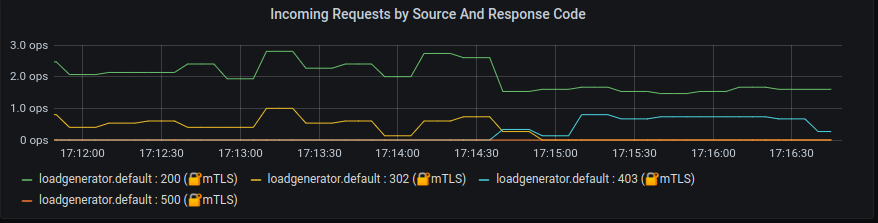

# Istio Authorization

**Istio Authorization Policy** enables access control on workloads in the mesh. To configure an authorization policy, you create an `AuthorizationPolicy` custom resource. It is **highly customizable**, allows you to match from namespace wide to specific workloads and investigate each request source and destination.

An authorization policy includes a selector, an action, and a list of rules:

* The `selector` field specifies the target of the policy
* The `action` field specifies whether to allow or deny the request
* The `rules` specify when to trigger the action
  * The `from` field in the rules specifies the sources of the request
  * The `to` field in the rules specifies the operations of the request
  * The `when` field specifies the conditions needed to apply the rule

[Here you can inspect](https://istio.io/latest/docs/reference/config/security/authorization-policy/) all the knobs and controls also [authorization policy conditions](https://istio.io/latest/docs/reference/config/security/conditions/), where you can specifies a list of additional conditions of a request.

## Create the service accounts

In order to give a strong identity to each service, service accounts are created and the deployments are patched.

```bash
$ make app_sa
serviceaccount/ad created
serviceaccount/cart created
serviceaccount/checkout created
serviceaccount/currency created
serviceaccount/email created
serviceaccount/frontend created
serviceaccount/loadgenerator created
serviceaccount/payment created
serviceaccount/productcatalog created
serviceaccount/recommendation created
serviceaccount/redis created
serviceaccount/shipping created
deployment.apps/adservice patched
deployment.apps/cartservice patched
deployment.apps/checkoutservice patched
deployment.apps/currencyservice patched
deployment.apps/emailservice patched
deployment.apps/frontend patched
deployment.apps/loadgenerator patched
deployment.apps/paymentservice patched
deployment.apps/productcatalogservice patched
deployment.apps/recommendationservice patched
deployment.apps/redis-cart patched
deployment.apps/shippingservice patched
```

## Example 1: Authorize checkout and frontend & service to communicate to currency service on port 7000

When peer authentication policies are used together with mutual TLS, Istio extracts the identity from the peer authentication into the `source.principal`. These principals can be used to set authorization policies and telemetry output.
The below policy we allow access to `currencyservice` only from `checkoutservice` and from `frontendservice`.
It is applied to `default` namespace and the destination port `7000`.

```yaml
apiVersion: security.istio.io/v1beta1
kind: AuthorizationPolicy
metadata:
  name: checkoutservice-to-paymentservice
  namespace: default
spec:
  selector:
    matchLabels:
      app: currencyservice
  action: ALLOW
  rules:
  - from:
    - source:
        principals: ["cluster.local/ns/default/sa/checkout"]
    - source:
        principals: ["cluster.local/ns/default/sa/frontend"]
  - to:
    - operation:
        ports: ["7000"]
```

## Example 2: Authorize HTTP GET calls from the loadgenerator 

Run the following command to create the policy allow-http-only-from-generator:

```bash
kubectl apply -f sm_Istio/istio_manifests/authorize_http.yml
```

This allows the generator workload, which issues requests using the cluster.local/ns/default/sa/loadgenerator service account, to access the frontend workload through GET methods.

```yaml
apiVersion: "security.istio.io/v1beta1"
kind: "AuthorizationPolicy"
metadata:
  name: "allow-http-only-from-generator"
  namespace: default
spec:
  selector:
    matchLabels:
      app: frontend
  rules:
  - from:
    - source:
        principals: ["cluster.local/ns/default/sa/loadgenerator"]
    to:
    - operation:
        methods: ["GET"]
```

Once the policy is applied its `Post` requests are `Forbidden`, as it can be seen in the below chart:



Check out the `Istio Workload Dashboard` from Graphana, run it in a different terminal:

```bash
./istio-1.7.4/bin/istioctl dashboard grafana
```

**[Back to Main Page](../README.md)**
