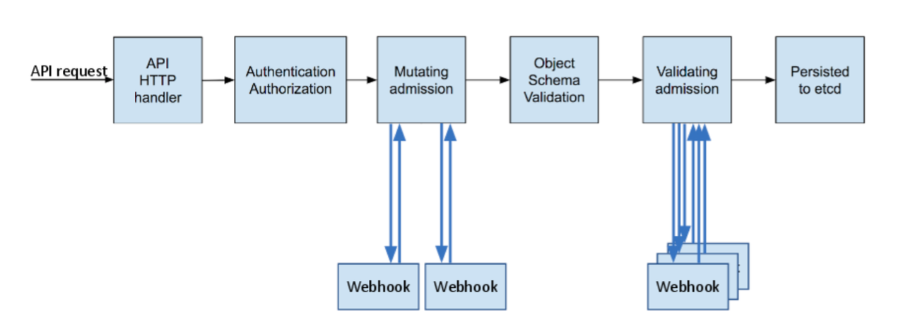

# Istio installed components

This section can be skipped, it's main goal is to visualize the components installed in the cluster during Istio install process. `Istioctl` permits to generate the manifest file, which can be manually deployed in the cluster. `This is not the recommended way to install Iatio as it has a [number of caveats](https://istio.io/latest/docs/setup/install/istioctl/#generate-a-manifest-before-installation).

Generate the manifest file and apply with `kapp` as it order the resources nicer.

```bash
./istio-1.7.4/bin/istioctl manifest generate --set profile=demo > generated-manifest.yaml
kapp deploy -a istio -f generated-manifest.yaml
```

Below are the resources installed in the cluster by Istio:

```bash
Namespace     Name                                      Kind
(cluster)     adapters.config.istio.io                  CustomResourceDefinition
^             attributemanifests.config.istio.io        CustomResourceDefinition
^             authorizationpolicies.security.istio.io   CustomResourceDefinition
^             destinationrules.networking.istio.io      CustomResourceDefinition
^             envoyfilters.networking.istio.io          CustomResourceDefinition
^             gateways.networking.istio.io              CustomResourceDefinition
^             handlers.config.istio.io                  CustomResourceDefinition
^             httpapispecbindings.config.istio.io       CustomResourceDefinition
^             httpapispecs.config.istio.io              CustomResourceDefinition
^             instances.config.istio.io                 CustomResourceDefinition
^             istio-reader-istio-system                 ClusterRole
^             istio-reader-istio-system                 ClusterRoleBinding
^             istio-sidecar-injector                    MutatingWebhookConfiguration
^             istiod-istio-system                       ClusterRole
^             istiod-istio-system                       ValidatingWebhookConfiguration
^             istiod-pilot-istio-system                 ClusterRoleBinding
^             istiooperators.install.istio.io           CustomResourceDefinition
^             peerauthentications.security.istio.io     CustomResourceDefinition
^             quotaspecbindings.config.istio.io         CustomResourceDefinition
^             quotaspecs.config.istio.io                CustomResourceDefinition
^             requestauthentications.security.istio.io  CustomResourceDefinition
^             rules.config.istio.io                     CustomResourceDefinition
^             serviceentries.networking.istio.io        CustomResourceDefinition
^             sidecars.networking.istio.io              CustomResourceDefinition
^             templates.config.istio.io                 CustomResourceDefinition
^             virtualservices.networking.istio.io       CustomResourceDefinition
^             workloadentries.networking.istio.io       CustomResourceDefinition
istio-system  istio                                     ConfigMap
^             istio-egressgateway                       Deployment
^             istio-egressgateway                       PodDisruptionBudget
^             istio-egressgateway                       Service
^             istio-egressgateway-sds                   Role
^             istio-egressgateway-sds                   RoleBinding
^             istio-egressgateway-service-account       ServiceAccount
^             istio-ingressgateway                      Deployment
^             istio-ingressgateway                      PodDisruptionBudget
^             istio-ingressgateway                      Service
^             istio-ingressgateway-sds                  Role
^             istio-ingressgateway-sds                  RoleBinding
^             istio-ingressgateway-service-account      ServiceAccount
^             istio-reader-service-account              ServiceAccount
^             istio-sidecar-injector                    ConfigMap
^             istiod                                    Deployment
^             istiod                                    PodDisruptionBudget
^             istiod                                    Service
^             istiod-istio-system                       Role
^             istiod-istio-system                       RoleBinding
^             istiod-service-account                    ServiceAccount
^             metadata-exchange-1.6                     EnvoyFilter
^             metadata-exchange-1.7                     EnvoyFilter
^             stats-filter-1.6                          EnvoyFilter
^             stats-filter-1.7                          EnvoyFilter
^             tcp-metadata-exchange-1.6                 EnvoyFilter
^             tcp-metadata-exchange-1.7                 EnvoyFilter
^             tcp-stats-filter-1.6                      EnvoyFilter
^             tcp-stats-filter-1.7                      EnvoyFilter
```

## Istio-System

Under istio-system namespace, the istio deployments are setup, with their respective `serviceaccount, role and rolebindings`:

```bash
$ kubectl get deployments -n istio-system
NAME                   READY   UP-TO-DATE   AVAILABLE   AGE
istio-egressgateway    1/1     1            1           71m
istio-ingressgateway   1/1     1            1           71m
istiod                 1/1     1            1           71m
```

## Cluster

In the Cluster a number of resources have been installed: `CRDs, WebHook Controllers and ClusterRoles for isitiod`.

### ClusterRoles

ClusterRole contains rules that represent a set of permissions. Permissions are purely additive (there are no "deny" rules)A Role always sets permissions within a particular namespace; when you create a Role, you have to specify the namespace it belongs in.  
ClusterRole, by contrast, is a non-namespaced resource. The resources have different names (Role and ClusterRole) because a Kubernetes object always has to be either namespaced or not namespaced; it can't be both.

This is what istio can do on the cluster level:

```bash
$ kubectl describe clusterrole istiod-istio-system

Resources                                                     Non-Resource URLs  Resource Names                  Verbs
  ---------                                                     -----------------  --------------                  -----
  ingresses.networking.k8s.io/status                            []                 []                              [*]
  signers.certificates.k8s.io                                   []                 [kubernetes.io/legacy-unknown]  [approve]
  configmaps                                                    []                 []                              [create get list watch update]
  tokenreviews.authentication.k8s.io                            []                 []                              [create]
  mutatingwebhookconfigurations.admissionregistration.k8s.io    []                 []                              [get list watch patch]
  validatingwebhookconfigurations.admissionregistration.k8s.io  []                 []                              [get list watch update]
  endpoints                                                     []                 []                              [get list watch]
  namespaces                                                    []                 []                              [get list watch]
  nodes                                                         []                 []                              [get list watch]
  pods                                                          []                 []                              [get list watch]
  services                                                      []                 []                              [get list watch]
  customresourcedefinitions.apiextensions.k8s.io                []                 []                              [get list watch]
  endpointslices.discovery.k8s.io                               []                 []                              [get list watch]
  ingressclasses.networking.k8s.io                              []                 []                              [get list watch]
  ingresses.networking.k8s.io                                   []                 []                              [get list watch]
  secrets                                                       []                 []                              [get watch list]
  *.authentication.istio.io                                     []                 []                              [get watch list]
  *.config.istio.io                                             []                 []                              [get watch list]
  *.networking.istio.io                                         []                 []                              [get watch list]
  *.networking.x-k8s.io                                         []                 []                              [get watch list]
  *.security.istio.io                                           []                 []                              [get watch list]
  certificatesigningrequests.certificates.k8s.io/approval       []                 []                              [update create get delete watch]
  certificatesigningrequests.certificates.k8s.io/status         []                 []                              [update create get delete watch]
  certificatesigningrequests.certificates.k8s.io                []                 []                              [update create get delete watch]
```

The ClusterRoleBinding assign the above ClusterRole to the istiod service account.

### Webhook Controllers

Kubernetes admission controllers are plugins that govern and enforce how the cluster is used. They can be thought of as a gatekeeper that intercept (authenticated) API requests and may change the request object or deny the request altogether. The admission control process has two phases: the mutating phase is executed first, followed by the validating phase.  
The difference between the two kinds of admission controller webhooks is pretty much self-explanatory: `mutating admission webhooks` may mutate the objects, while `validating admission webhooks` may not.



Kubernetes comes with a number of built in [admission controllers](https://kubernetes.io/docs/reference/access-authn-authz/admission-controllers/#what-does-each-admission-controller-do) but you can create your owns for your specific needs.

In the install process, the `istio-injection=enabled` label on was setup for the `defautl` namespace. As the injection webhook is enabled, ***any new pods that are created in that namespace will automatically have a sidecar added to them***.

```bash
$ kubectl get mutatingwebhookconfigurations.admissionregistration.k8s.io
NAME                     WEBHOOKS   AGE
istio-sidecar-injector   1          123m
```

On the other hand `istiod validatingwebhookconfigurations` ensures user authored Istio configuration is syntactically and semantically valid.

```bash
$ kubectl get validatingwebhookconfigurations.admissionregistration.k8s.io
NAME                  WEBHOOKS   AGE
istiod-istio-system   1          123m
```

### CRDs

Before defining CRDs, let’s look at what Controllers does. Based on Kubernetes Glossary reference, controllers are control loops that watch the state of your cluster, then make or request changes where needed. Each controller tries to move the current cluster state closer to the desired state. So basically, a controller tracks at least one Kubernetes resource type. These objects have a spec field that represents the desired state. The controller for that resource are responsible for making the current state come closer to that desired state.

The Custom Resource is an endpoint in the Kubernetes API that stores a collection of API objects of a certain kind. For example, the built-in pods resource contains a collection of Pod objects. A custom resource is an extension of the Kubernetes API that is not necessarily available in a default Kubernetes installation. Many core Kubernetes functions are now built using custom resources, making Kubernetes more modular.

A Custom Resource Definition (CRD) file defines your own object kinds and lets the API Server handle the entire lifecycle. Deploying a CRD into the cluster causes the Kubernetes API server to begin serving the specified custom resource. When you create a new custom resource definition (CRD), the Kubernetes API Server reacts by creating a new RESTful resource path, that can be accessed by an entire cluster or a single project (namespace).

Istio is comming with a collection of CRD's which are used to manage how the service mesh behave.

#### Traffic Management

* **gateways.networking.istio.io** - describes a load balancer operating at the edge of the mesh receiving incoming or outgoing HTTP/TCP connections.
* **virtualservices.networking.istio.io** - defines a set of traffic routing rules to apply when a host is addressed. Each routing rule defines matching criteria for traffic of a specific protocol. If the traffic is matched, then it is sent to a named destination service (or subset/version of it) defined in the registry.
* **destinationrules.networking.istio.io** - defines policies that apply to traffic intended for a service after routing has occurred.
* **envoyfilters.networking.istio.io** - provides a mechanism to customize the Envoy configuration generated by Istio Pilot.
* **serviceentries.networking.istio.io** - enables adding additional entries into Istio’s internal service registry, so that auto-discovered services in the mesh can access/route to these manually specified services.
* **sidecars.networking.istio.io** - describes the configuration of the sidecar proxy that mediates inbound and outbound communication to the workload instance it is attached to.
* **workloadentries.networking.istio.io** -  enables operators to describe the properties of a single non-Kubernetes workload such as a VM or a bare metal server as it is onboarded into the mesh.

#### Security

* **authorizationpolicies.security.istio.io** - enables access control on workloads in the mesh. Istio Authorization Policy also supports the AUDIT action to decide whether to log requests. AUDIT policies do not affect whether requests are allowed or denied to the workload. Requests will be allowed or denied based solely on ALLOW and DENY policies.
* **peerauthentications.security.istio.io** - defines how traffic will be tunneled (or not) to the sidecar. Policy to allow mTLS traffic for all workloads. (Strict or Permissive for mTLS)
* **requestauthentications.security.istio.io** - defines what request authentication methods are supported by a workload.

In this Istio version some CRDs may be deprecated but are kept for backward compatibility. `Mixer is deprecated. The functionality provided by Mixer is being moved into the Envoy proxies. Use of Mixer with Istio will only be supported through the 1.7 release of Istio.`.

**[Back to Main Page](../README.md)**
