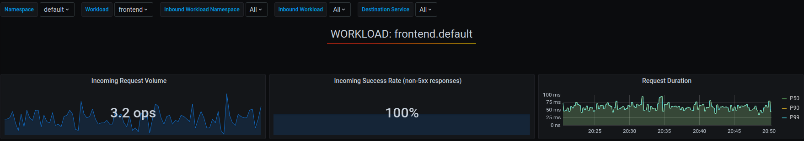
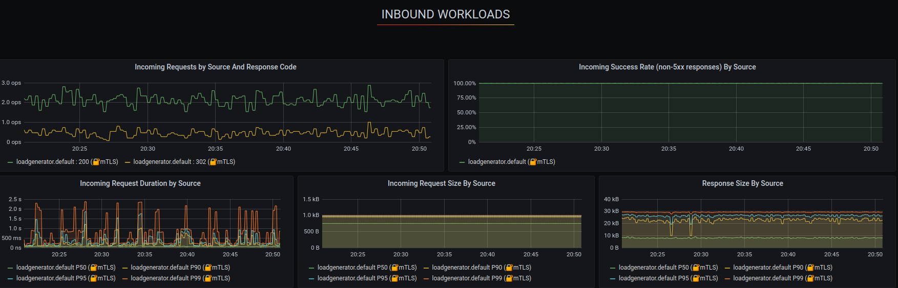
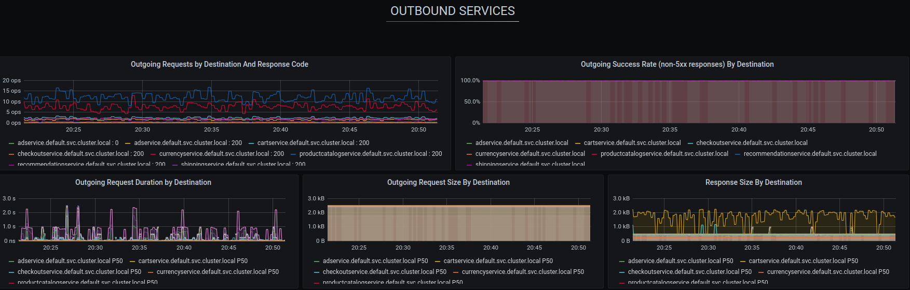

# Integrations

Istio can integrate with a number of components, like `cert-manager, grafana, jaeger, kiali, prometheus, zipkin` to provide additonal functionality. [Check out here](https://istio.io/latest/docs/ops/integrations/) all the integrations and the install procedure.

I'm installing [Prometheus](https://prometheus.io/), which is an open source monitoring system and time series database. You can use Prometheus with Istio to record metrics that track the health of Istio and of applications within the service mesh. You can visualize metrics using tools like Grafana and Kiali.  
And [Grafana](https://grafana.com/), which is an open source monitoring solution that can be used to configure dashboards for Istio. You can use Grafana to monitor the health of Istio and of applications within the service mesh.

Below are the resources installed by Prometheus:

```bash
$ kapp deploy -a prometheus -f https://raw.githubusercontent.com/istio/istio/release-1.7/samples/addons/prometheus.yaml
Target cluster 'https://127.0.0.1:34761' (nodes: kind-istio-control-plane, 2+)

Changes

Namespace     Name        Kind                Conds.  Age  Op      Op st.  Wait to    Rs  Ri  
(cluster)     prometheus  ClusterRole         -       -    create  -       reconcile  -   -  
^             prometheus  ClusterRoleBinding  -       -    create  -       reconcile  -   -  
istio-system  prometheus  ConfigMap           -       -    create  -       reconcile  -   -  
^             prometheus  Deployment          -       -    create  -       reconcile  -   -  
^             prometheus  Service             -       -    create  -       reconcile  -   -  
^             prometheus  ServiceAccount      -       -    create  -       reconcile  -   -
```

or using:

```bash
kubectl apply -f https://raw.githubusercontent.com/istio/istio/release-1.7/samples/addons/prometheus.yaml
```

Best part, Istio offers a set of preconfigured dashboards for all of the most important metrics for the mesh and for the control plane.

* **Mesh Dashboard** provides an overview of all services in the mesh.
* **Service Dashboard** provides a detailed breakdown of metrics for a service.
* **Workload Dashboard** provides a detailed breakdown of metrics for a workload.
* **Performance Dashboard** monitors the resource usage of the mesh.
* **Control Plane Dashboard** monitors the health and performance of the control plane.

These are the installed resources while deploying grafana to the cluster. Notice that it uses istio-namespace as it is an custom grafana instalation to seamlessly integrate with Istio.

```bash
$ kapp deploy -a grafana -f https://raw.githubusercontent.com/istio/istio/release-1.7/samples/addons/grafana.yaml
Target cluster 'https://127.0.0.1:34761' (nodes: kind-istio-control-plane, 2+)

Changes

Namespace     Name                               Kind            Conds.  Age  Op      Op st.  Wait to    Rs  Ri  
istio-system  grafana                            ConfigMap       -       -    create  -       reconcile  -   -  
^             grafana                            Deployment      -       -    create  -       reconcile  -   -  
^             grafana                            Service         -       -    create  -       reconcile  -   -  
^             grafana                            ServiceAccount  -       -    create  -       reconcile  -   -  
^             istio-grafana-dashboards           ConfigMap       -       -    create  -       reconcile  -   -  
^             istio-services-grafana-dashboards  ConfigMap       -       -    create  -       reconcile  -   -
```

or using:

```bash
kubectl apply -f https://raw.githubusercontent.com/istio/istio/release-1.7/samples/addons/grafana.yaml
```

Now you can issue the below command which port forward to the right deployment and open the browser to with Grafana dashaboard. Under `Dashboard` --> `Manage` you can find the preconfigured dashboards as I mentioned above.

```bash
istioctl dashboard grafana
http://localhost:3000
```

## Grafana Integration





**[Back to Main Page](../README.md)**
