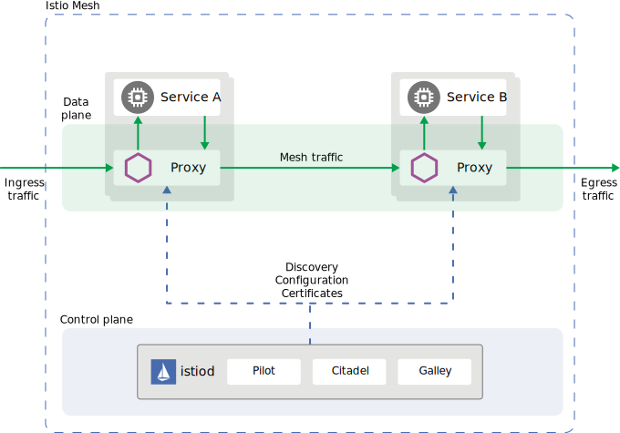

# Istio

Below product description is collected from the [Istio.io](https://istio.io/) official documentation.

It is a completely open source service mesh that layers transparently onto existing distributed applications. It is also a platform, including APIs that let it integrate into any logging platform, or telemetry or policy system. Istio’s diverse feature set lets you successfully, and efficiently, run a distributed microservice architecture, and provides a uniform way to secure, connect, and monitor microservices.

You add Istio support to services by deploying a special sidecar proxy throughout your environment that intercepts all network communication between microservices, then configure and manage Istio using its control plane functionality, which includes:

* Automatic load balancing for HTTP, gRPC, WebSocket, and TCP traffic.
* Fine-grained control of traffic behavior with rich routing rules, retries, failovers, and fault injection.
* A pluggable policy layer and configuration API supporting access controls, rate limits and quotas.
* Automatic metrics, logs, and traces for all traffic within a cluster, including cluster ingress and egress.
* Secure service-to-service communication in a cluster with strong identity-based authentication and authorization.

## Architecture

An Istio service mesh is logically split into a data plane and a control plane.  
**The data plane** is composed of a set of intelligent proxies (Envoy) deployed as sidecars. These proxies mediate and control all network communication between microservices. They also collect and report telemetry on all mesh traffic.  
**The control plane** manages and configures the proxies to route traffic.

**[Back to Main Page](../README.md)**
